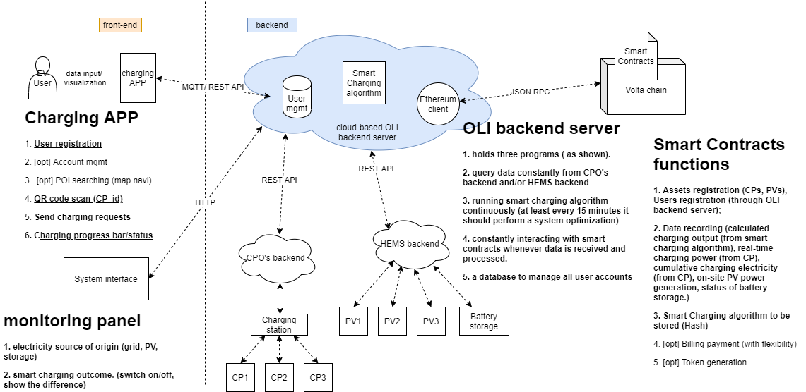

First of all, it is important to make it clear about what product we want to create or delivery to the market (our vision).But often the case is that such product can not be finished at once. Like other software product, it requires many iteration to add functions gradually and fix the bugs. Please also note that, we should also meet the clients' (partners') expectation as well as take the User (customer) experience into account. In the end, this triangle (user, clients, and us) will direct us into the shared/ necessary focus points. 

Our goal is to launch a blockchain based EV charging system with following functions:
1. Grid friendly smart charging (coordinated charging/ bottleneck management for grid infrastructure)
2. Enviornmentally friendly smart charging (electricity source of origin)
3. User friendly smart charging (better align with users' schedule)

a workshop on user journey or user story ampping is recommended in order to gain more knowledge on user demand. Several needs are identified: convenient, transparent, and green going. Therefore, the charging APP, as the user interface should be able to show the user:
1. the availabiltiy of all charging assets for user selection (before the charging); 
2. the App should also inform the updated charging status to the user (during the charging process); and 
3. tell the user how much green electricity they are supplied with for the charging (after the charging)

as our client only want to see the demonstration of our product to integrate into their charging assets but no other extra expectation. 

After the concept and ideas are clear, we need to plot an architecture because what we are offering to our clients is a software solution. Since we try to avoid the involvement of hardware, all the data will be provided by our clients and, to some extent, we are highly dependent on their backend. 

We start with a project architecture

Next thing is to consider the feasibility of the idea, if not then what's the back up plan or alternative. i.e. What role the Blockchain should play in this project. It is not a good idea to have data manipulation on the blockchain. 

now let's look into the timeline. In our model, each timestep is regarded as a 15 minutes interval. and users are free to send charging requests during the first 14 minutes. In the last minute of the timestep, a system optimization is carried out. Any new charging request received during this period can only start charging after the next timestep.

The smart charging package is composed with two major functions, namely charging_request_simulation and system_charging_optimization. 

